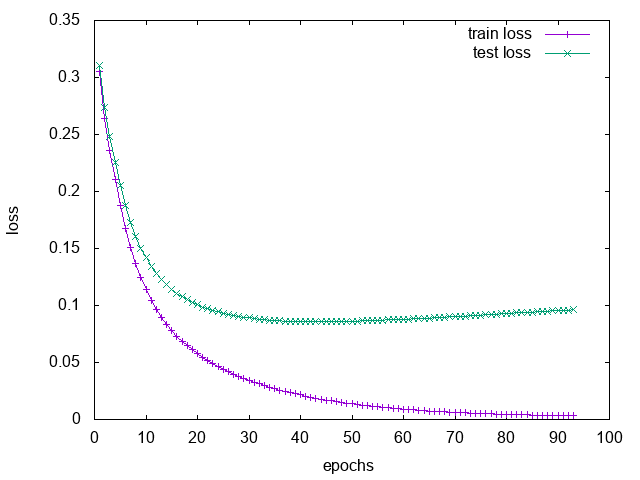

# Difference Target Propagation

I give a torch implementation of difference target propagation.
The motivation is approximating backpropagation without depending
on differentiability of activation function or propagating the global error.
 
Author: Alireza Goudarzi  
Email: alireza.goudarzi@riken.jp  
 

You can find the original Theano implementation <a href='https://github.com/donghyunlee/dtp'>here</a>.
You can find the arxiv paper <a href='https://arxiv.org/abs/1412.7525'>here</a>.

## Dependencies

The code is written for Torch7. The following packages are required:  
nn 
dataload 
optim 
dpnn 
sys 

## How to 

run on CPU:

   th diff_traget_prop_v3.lua

run on GPU:

   th diff_traget_prop_v3.lua -gpu 1

generate plots:

   gnuplot gnu_script.gnu

## Notes

Loss normalization in torch normalizes by batchsize and dimentions. To get identical results you need to turn off normalization and divide the loss by batchsize manually. You need to use the centered version of rmsprop to match original Theano results. optim.rmsprop doesn't offer this option so I extended it. The code is included here as a function. 

No momentum is used in the optimization. In each epoch, first the inverse model is trained on the entire
dataset and then the forward model is trained (as in the original implementation).

## Results

Using 50,000 MNIST examples to train and 10,000 to test the performance. 

 

