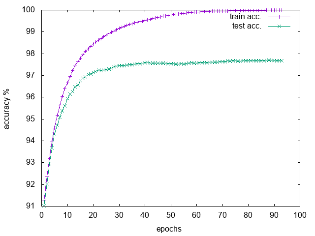

# difference-target-propagation

I give a torch implementation of difference target propagation.
The motivation is approximating backpropagation without depending
on differentiability of activation function or propagating the global error.

Author: Alireza Goudarzi
Email: alireza.goudarzi@riken.jp
copyright 2017, allrights reserved. 

You can find the original Theano implementation <a href='https://github.com/donghyunlee/dtp'>here</a>.

## Dependencies

nn
dataload
optim
dpnn
sys
nninit

## How to run on cpu

th diff_traget_prop_v3.lua

## How to run on gpu

th diff_traget_prop_v3.lua -gpu 1

## generate plots
gnuplot gnu_script.gnu

## Notes

## Results

 

